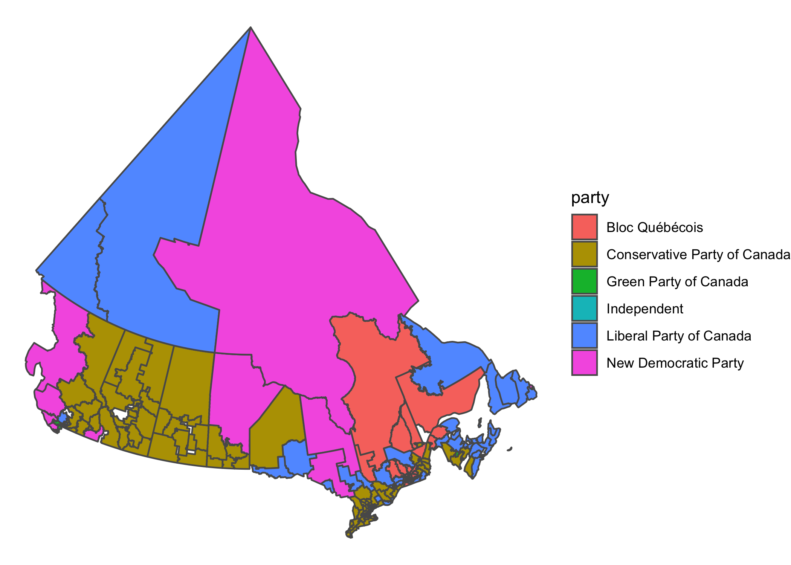

<!-- README.md is generated from README.Rmd. Please edit that file -->

# electionca

<!-- badges: start -->

[](https://www.tidyverse.org/lifecycle/#experimental)
<!-- badges: end -->

The goal of electionca is to provide Canadian (general) election data in
an easily accessible format for R users. It is based on the Library of
Parliament’s [ParlInfo
site](https://lop.parl.ca/sites/ParlInfo/default/en_CA/), but also
includes geography for elections since 2003
([2003](https://open.canada.ca/data/en/dataset/78400aed-2370-4437-97ca-7563c21bacb1),
[2013](https://open.canada.ca/data/en/dataset/10801c67-7f18-4ea1-bda7-8962abfc5578)
and
[2015](https://open.canada.ca/data/en/dataset/737be5ea-27cf-48a3-91d6-e835f11834b0)).
Approximate geography is derived for historical ridings based on riding
associations noted by the Library of Parliament.

## Installation

You can install the development version from
[GitHub](https://github.com/) with:

``` r
# install.packages("devtools")
devtools::install_github("paleolimbot/electionca")
```

## Example

This package contains geographic information about
[ridings](https://lop.parl.ca/sites/ParlInfo/default/en_CA/ElectionsRidings/Ridings)
(`ridings`), [results from each
riding](https://lop.parl.ca/sites/ParlInfo/default/en_CA/ElectionsRidings/Elections)
for each general election (`results`), and low-resolution boundaries,
where these are known (2004-present).

``` r
library(electionca)
results
#> # A tibble: 42,096 x 7
#>    election_date riding      name        party       votes result person_id
#>    <date>        <chr>       <chr>       <chr>       <dbl> <chr>      <dbl>
#>  1 1867-08-07    NB/1867/al… John WALLA… Liberal Pa…   778 Elect…     15128
#>  2 1867-08-07    NB/1867/al… Henry J. S… Unknown       714 Defea…        NA
#>  3 1867-08-07    NB/1867/ca… Charles CO… Liberal Pa…     0 Elect…     16576
#>  4 1867-08-07    NB/1867/ch… John BOLTON Liberal Pa…  1214 Elect…     13379
#>  5 1867-08-07    NB/1867/ch… Robert THO… Unknown       918 Defea…        NA
#>  6 1867-08-07    NB/1867/gl… Timothy Wa… Liberal Pa…  1061 Elect…     14587
#>  7 1867-08-07    NB/1867/gl… John MEHAN  Unknown       671 Defea…        NA
#>  8 1867-08-07    NB/1867/ke… Auguste RE… Liberal Pa…   876 Elect…      4768
#>  9 1867-08-07    NB/1867/ke… NA DES BRI… Unknown       757 Defea…        NA
#> 10 1867-08-07    NB/1867/ke… NA MCINERN… Unknown       485 Defea…        NA
#> # … with 42,086 more rows
ridings
#> # A tibble: 1,493 x 9
#>    riding riding_label year_start year_end riding_id province boundary_id
#>    <chr>  <chr>             <dbl>    <dbl>     <dbl> <chr>          <int>
#>  1 AB/19… Calgary            1904     1908      1371 Alberta           NA
#>  2 AB/19… Medicine Hat       1907     2015      5224 Alberta           73
#>  3 AB/19… Edmonton           1908     1917      2704 Alberta           NA
#>  4 AB/19… Macleod            1908     1968      5037 Alberta           NA
#>  5 AB/19… Red Deer           1908     2015      7064 Alberta           79
#>  6 AB/19… Strathcona         1908     1925      8822 Alberta           NA
#>  7 AB/19… Victoria           1908     1925      9615 Alberta           NA
#>  8 AB/19… Battle River       1917     1953       808 Alberta           NA
#>  9 AB/19… Bow River          1917     1968      1119 Alberta           NA
#> 10 AB/19… Calgary West       1917     1953      1395 Alberta           NA
#> # … with 1,483 more rows, and 2 more variables: lon <dbl>, lat <dbl>
boundaries
#> Simple feature collection with 463 features and 1 field
#> geometry type:  GEOMETRY
#> dimension:      XY
#> bbox:           xmin: -2371619 ymin: -724687.7 xmax: 3012991 ymax: 4654012
#> epsg (SRID):    3978
#> proj4string:    +proj=lcc +lat_1=49 +lat_2=77 +lat_0=49 +lon_0=-95 +x_0=0 +y_0=0 +ellps=GRS80 +towgs84=0,0,0,0,0,0,0 +units=m +no_defs
#> # A tibble: 463 x 2
#>    boundary_id                                                     geometry
#>          <int>                                                <POLYGON [m]>
#>  1           2 ((-1480862 604541.3, -1478280 615286.5, -1477359 611351.2, …
#>  2           4 ((-1262781 491857.4, -1261876 494990.4, -1260382 494478.8, …
#>  3           6 ((-1299614 400326.3, -1297659 406765.2, -1299582 407354.3, …
#>  4           7 ((-1310951 424734.8, -1310560 424750.1, -1310582 425203.6, …
#>  5          10 ((-1305088 433897.2, -1304074 432879.3, -1303496 432022.3, …
#>  6          12 ((-1313840 429506.3, -1313692 429729.6, -1312952 429856.5, …
#>  7          13 ((-1297952 423636.4, -1296416 423176, -1300204 410982.6, -1…
#>  8          14 ((-1304270 422950.8, -1304184 423362.5, -1304044 423337.6, …
#>  9          16 ((-1321973 410839.1, -1321011 413951.2, -1316401 412521.5, …
#> 10          19 ((-1315167 405380.6, -1314036 408925.6, -1314172 409803.7, …
#> # … with 453 more rows
```

Still working on some aspects of the data cleaning, including finding a
few missing ridings that should have candidates.

``` r
library(tidyverse)
library(lubridate)
results %>%
  filter(year(election_date) == 2019, result == "Elected") %>%
  left_join(ridings, by = "riding") %>%
  left_join(boundaries, by = "boundary_id") %>%
  ggplot(aes(fill = party, geometry = geometry))  +
  geom_sf() +
  theme_void()
```


