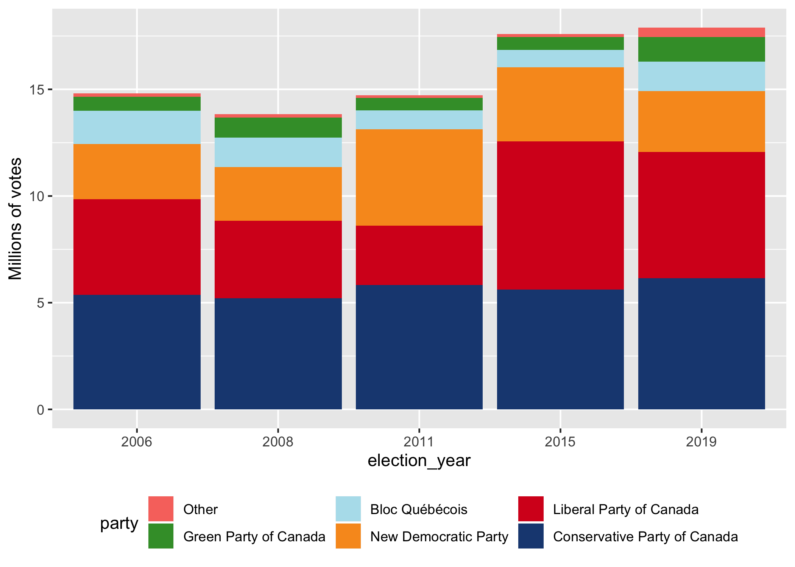
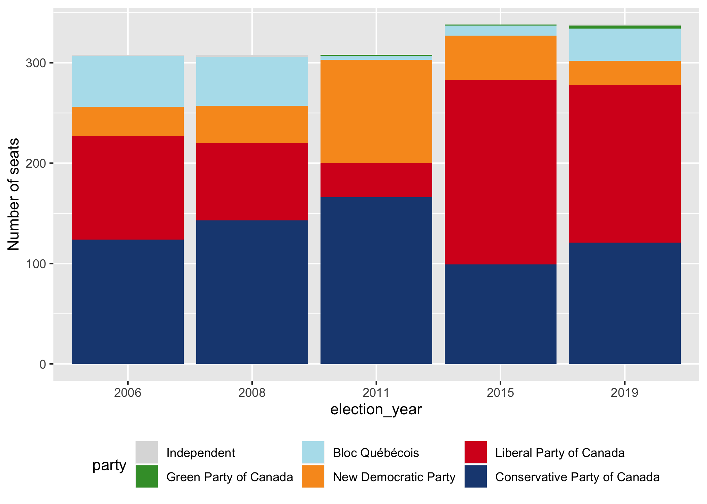
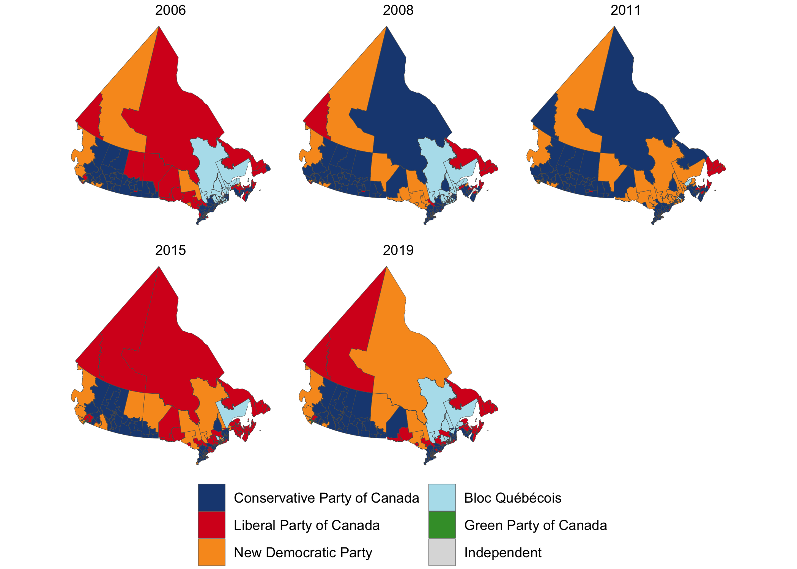

<!-- README.md is generated from README.Rmd. Please edit that file -->

# electionca

<!-- badges: start -->

[](https://www.tidyverse.org/lifecycle/#experimental)
[](https://travis-ci.org/paleolimbot/electionca)
<!-- badges: end -->

The goal of electionca is to provide Canadian (general) election data in
an easily accessible format for R users. It is based on the Library of
Parliament’s [ParlInfo
site](https://lop.parl.ca/sites/ParlInfo/default/en_CA/), but also
includes geography for elections since 2003
([2003](https://open.canada.ca/data/en/dataset/78400aed-2370-4437-97ca-7563c21bacb1),
[2013](https://open.canada.ca/data/en/dataset/10801c67-7f18-4ea1-bda7-8962abfc5578)
and
[2015](https://open.canada.ca/data/en/dataset/737be5ea-27cf-48a3-91d6-e835f11834b0)).
Approximate geography is derived for historical ridings based on riding
associations noted by the Library of Parliament.

## Installation

You can install the development version from
[GitHub](https://github.com/) with:

``` r
# install.packages("devtools")
devtools::install_github("paleolimbot/electionca")
```

If you can load the package, you’re all set\!

``` r
library(electionca)
```

## Example

This package contains geographic information about
[ridings](https://lop.parl.ca/sites/ParlInfo/default/en_CA/ElectionsRidings/Ridings)
(`ridings`), [results from each
riding](https://lop.parl.ca/sites/ParlInfo/default/en_CA/ElectionsRidings/Elections)
for each general election (`results`), and low-resolution boundaries,
where these are known (2006-present). It contains convenience functions
to plot election results in bar, cartogram, and map format:

``` r
plot_votes()
```



``` r
plot_seats()
```



``` r
plot_election()
```


``` r
plot_election_map()
```



The easiest way to access the data in this package is through the
`election_results()` function, which modifies the raw data slightly to
provide the data that you probably want to work with:

``` r
election_results()
#> # A tibble: 42,096 x 11
#>    election_date riding name  party votes result person_id province
#>    <date>        <chr>  <chr> <chr> <dbl> <chr>      <dbl> <fct>   
#>  1 1867-08-07    NB/18… John… Libe…   778 Elect…     15128 New Bru…
#>  2 1867-08-07    NB/18… Henr… Unkn…   714 Defea…        NA New Bru…
#>  3 1867-08-07    NB/18… Char… Libe…     0 Elect…     16576 New Bru…
#>  4 1867-08-07    NB/18… John… Libe…  1214 Elect…     13379 New Bru…
#>  5 1867-08-07    NB/18… Robe… Unkn…   918 Defea…        NA New Bru…
#>  6 1867-08-07    NB/18… Timo… Libe…  1061 Elect…     14587 New Bru…
#>  7 1867-08-07    NB/18… John… Unkn…   671 Defea…        NA New Bru…
#>  8 1867-08-07    NB/18… Augu… Libe…   876 Elect…      4768 New Bru…
#>  9 1867-08-07    NB/18… NA D… Unkn…   757 Defea…        NA New Bru…
#> 10 1867-08-07    NB/18… NA M… Unkn…   485 Defea…        NA New Bru…
#> # … with 42,086 more rows, and 3 more variables: riding_label <chr>,
#> #   riding_id <dbl>, election_year <dbl>
```

If you’re looking to do a more comprehensive analysis, you can access
the raw data using `results`, `ridings`, and `boundaries`.

``` r
results
#> # A tibble: 42,096 x 7
#>    election_date riding      name        party       votes result person_id
#>    <date>        <chr>       <chr>       <chr>       <dbl> <chr>      <dbl>
#>  1 1867-08-07    NB/1867/al… John WALLA… Liberal Pa…   778 Elect…     15128
#>  2 1867-08-07    NB/1867/al… Henry J. S… Unknown       714 Defea…        NA
#>  3 1867-08-07    NB/1867/ca… Charles CO… Liberal Pa…     0 Elect…     16576
#>  4 1867-08-07    NB/1867/ch… John BOLTON Liberal Pa…  1214 Elect…     13379
#>  5 1867-08-07    NB/1867/ch… Robert THO… Unknown       918 Defea…        NA
#>  6 1867-08-07    NB/1867/gl… Timothy Wa… Liberal Pa…  1061 Elect…     14587
#>  7 1867-08-07    NB/1867/gl… John MEHAN  Unknown       671 Defea…        NA
#>  8 1867-08-07    NB/1867/ke… Auguste RE… Liberal Pa…   876 Elect…      4768
#>  9 1867-08-07    NB/1867/ke… NA DES BRI… Unknown       757 Defea…        NA
#> 10 1867-08-07    NB/1867/ke… NA MCINERN… Unknown       485 Defea…        NA
#> # … with 42,086 more rows
ridings
#> # A tibble: 1,493 x 8
#>    riding   riding_label year_start year_end riding_id province   lon   lat
#>    <chr>    <chr>             <dbl>    <dbl>     <dbl> <chr>    <dbl> <dbl>
#>  1 AB/1904… Calgary            1904     1908      1371 Alberta  -113.  51.7
#>  2 AB/1907… Medicine Hat       1907     2015      5224 Alberta  -111.  50.0
#>  3 AB/1908… Edmonton           1908     1917      2704 Alberta  -114.  53.6
#>  4 AB/1908… Macleod            1908     1968      5037 Alberta  -112.  50.9
#>  5 AB/1908… Red Deer           1908     2015      7064 Alberta  -114.  52.1
#>  6 AB/1908… Strathcona         1908     1925      8822 Alberta  -114.  52.8
#>  7 AB/1908… Victoria           1908     1925      9615 Alberta  -114.  52.8
#>  8 AB/1917… Battle River       1917     1953       808 Alberta  -114.  52.1
#>  9 AB/1917… Bow River          1917     1968      1119 Alberta  -112.  51.3
#> 10 AB/1917… Calgary West       1917     1953      1395 Alberta  -114.  52.1
#> # … with 1,483 more rows
boundaries
#> Simple feature collection with 1600 features and 2 fields
#> geometry type:  GEOMETRY
#> dimension:      XY
#> bbox:           xmin: -2371619 ymin: -724687.7 xmax: 3012991 ymax: 4654012
#> epsg (SRID):    3978
#> proj4string:    +proj=lcc +lat_1=49 +lat_2=77 +lat_0=49 +lon_0=-95 +x_0=0 +y_0=0 +ellps=GRS80 +towgs84=0,0,0,0,0,0,0 +units=m +no_defs
#> # A tibble: 1,600 x 3
#>    election_date riding                                            boundary
#>    <date>        <chr>                                        <POLYGON [m]>
#>  1 2006-01-23    AB/1907/medici… ((-1173009 394195.8, -1172396 393674.9, -…
#>  2 2006-01-23    AB/1908/red_de… ((-1282197 563271.4, -1279521 562433.7, -…
#>  3 2006-01-23    AB/1925/peace_… ((-1032020 1302682, -1098867 1085578, -11…
#>  4 2006-01-23    AB/1925/wetask… ((-1278147 676705, -1278199 676488.1, -12…
#>  5 2006-01-23    AB/1953/edmont… ((-1191073 673934.7, -1190621 674150.3, -…
#>  6 2006-01-23    AB/1968/crowfo… ((-1153444 636376.6, -1153873 634881.6, -…
#>  7 2006-01-23    AB/1979/calgar… ((-1313621 434403.1, -1311302 431518.2, -…
#>  8 2006-01-23    AB/1979/yellow… ((-1474371 894567.9, -1461911 889687.5, -…
#>  9 2006-01-23    AB/1988/calgar… ((-1296230 423767.1, -1296416 423176, -13…
#> 10 2006-01-23    AB/1988/calgar… ((-1305123 411846.9, -1305024 411769.9, -…
#> # … with 1,590 more rows
```

For examples of how to use the raw data to create the plots returned by
`plot_election_map()` and `plot_election()`, see
`vignette("plot_election", package = "electionca")`.
